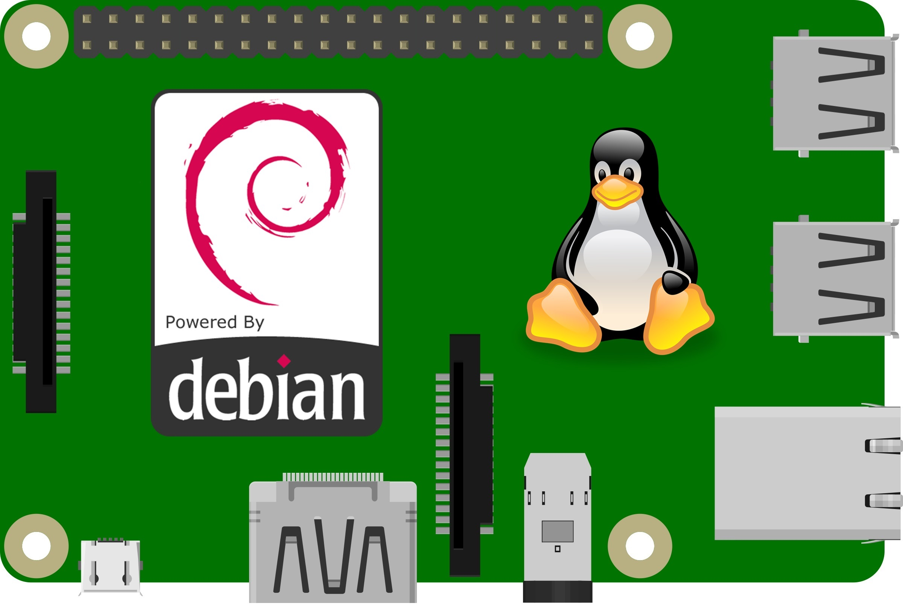

# Debian Made up for Raspberry Pi



The project is a set of scripts that simplifies and automates the process of building a complete and bootable Debian image for the Raspberry Pi SBCs. 
The goal is to build a headless and generic Debian image with the Kernel version of your choice. 
By default, the most recent version is chosen. Also, you can configure the kernel if needed.
It should also possible to build an Ubuntu image but, you will have to dig the code.

<br clear="right">


update 15.10.2025 : 
If you need to expand the rootfs, you can follow this guide https://mattheweaton.net/posts/how-to-enlarge-partitions-in-linux. GParted is also a good solution.

update 29.08.2026 : 
The project has been partially rewritten in Python. Now, if you want to configure your Debian image, you just have to edit the csv files in the folder "stock/csv" :
- The file "repos_lst.csv" contains the repositories url to clone.
- The file "construction_cfg.csv" contains the variables required for the kernel cross-compilation.
- The file "distro_ver.csv" contains the mandatory informations in order to build the image file.<br />
  If you have to change the distribution version, you only have to change the "ID" and the "RELEASE".

usage :
```bash
[-R] Raspberry pi models : (RPi5|500|500+|cm5|RPi4|400|cm4|cm4s|RPi3|RPi3+|cm3|cm3+|zero2w|RPi2|RPi1|cm1|zero|zerow)

[-c] item(s) to remove : all -> Deletes the root file system image and the repos.
                         rootfs -> Deletes only the root file system image.
                         repos -> Deletes the directory where the repository are cloned.

[-a] cpu architecture : armhf -> 32-bit architecture
                        aarch64 -> 64-bit architecture

[-k] this switch allows the kernel configuration.

[-x] this switch compress the image file.

main.sh -R <RPi model> [del][-c (all|rootfs|repos)] [opt][-a (cpu) -k -x]
```

